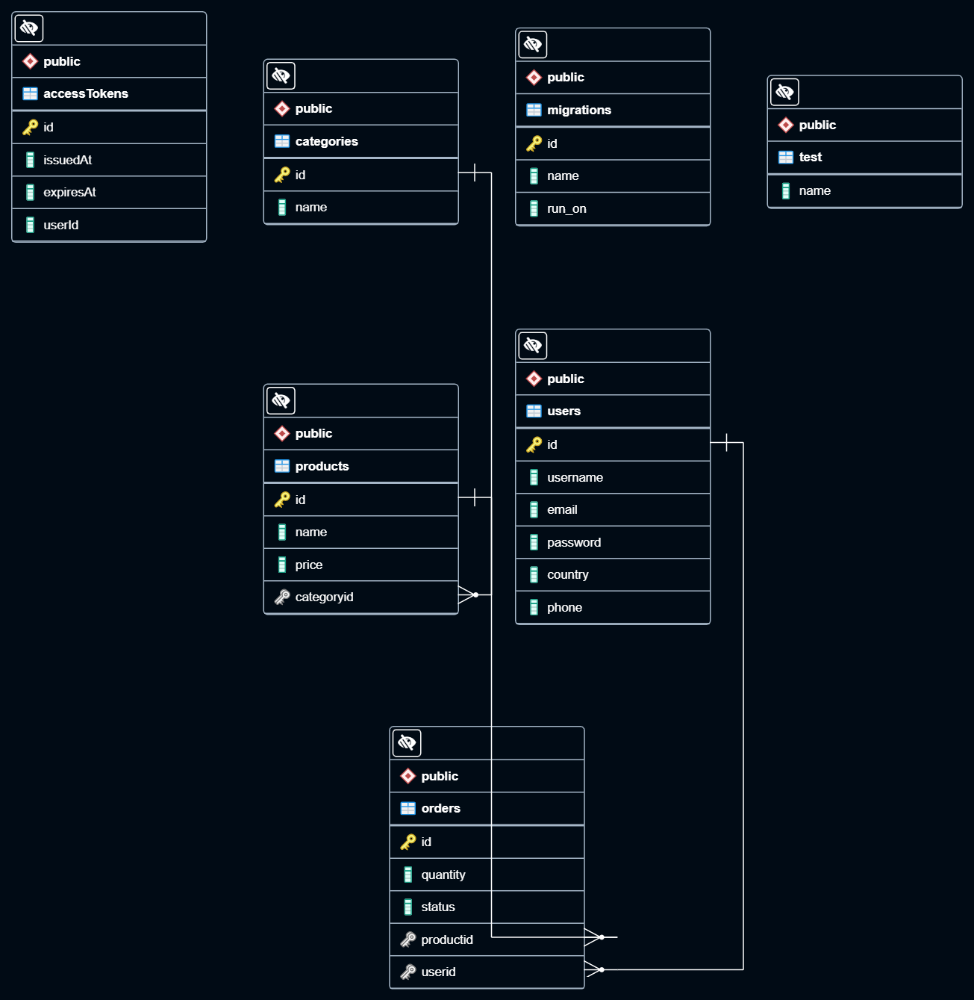

# Udacity: Build a Storefront Backend

## Contents:

1-Description.

2-Project build depended on.

3-Database diagram

4-Project Structure.

5-How To Use.

6-Functionality and Endpoints.

7-Development.

## Description

This is a backend API build in Nodejs for an online store. It exposes a RESTful API that will be used by the frontend developer on the frontend.

The database schema and and API route information can be found in the [REQUIREMENT.md](REQUIREMENTS.md)

## Database diagram



### Installing

- You cane download my project.

```
git clone https://github.com/aml-fakhry/store_front_APP.git
```

- project requires having node installed https://nodejs.org/en/download/

## Project build depended on

- The language used and application logic

1. [TypeScript] (https://www.typescriptlang.org/docs/)
2. [Node.JS] (https://nodejs.org/dist/latest-v16.x/docs/api/)
3. [Express] (https://expressjs.com/)

- For managing environment variables

1. [dotenv] (https://www.npmjs.com/package/dotenv)

- For the database and migration

1. [pg] (https://node-postgres.com/)
2. [db-migrate] (https://db-migrate.readthedocs.io/en/latest/)
3. [db-migrate-pg] (https://www.npmjs.com/package/db-migrate-pg)

- For authentication and security

1. [jsonwebtoken] (https://www.npmjs.com/package/jsonwebtoken)
2. [bcrypt] (https://www.npmjs.com/package/bcrypt)
3. [morgan] (https://www.npmjs.com/package/morgan)
4. [helmet] (https://www.npmjs.com/package/helmet)

- For Fixing and Formatting Code

1. [ESLint] (https://eslint.org/docs/user-guide/getting-started)
2. [Prettier] (https://prettier.io/docs/en/index.html)

- For Unit testing

1. [Jasmine] (https://jasmine.github.io/)
2. [supertest] (https://www.npmjs.com/package/supertest)

### Executing program (scripts)

- Install all dependencies

```
yarn
```

- Run the program in development environment.

```
yarn dev
```

- Run compiled code (build).

```
yarn start:build
```

- Run test program.

```
yarn test
```

- Lint script.

```
yarn lint
```

- Format script.

```
yarn format
```

## Functionality

1- Resize image

- resizeImage() method to resize images.
- @param filename the file name to be processed.
- @param width the width of image.
- @param height the height of image.
- @returns promise of data result.

```
(method) resizeImage(filename: string, width: number, height: number): Promise<DataResult>
```

## Unit tests.

1- Check if image exist in full or thumb folders.

```javascript
describe('Check if image exist in full or thumb folders.', () => {
  it('Pass when image exist in full folder.', () => {
    const result = fs.existsSync(fullPic1Path);
    expect(result).toBeTruthy();
  });

  it('Pass when image not exist in full folder.', () => {
    const result = fs.existsSync(thumbPic1Path);
    expect(result).not.toBeTruthy();
  });
});
```

2- Check if returned data from resizeImage().

```javascript
describe('Check if returned data from resizeImage().', () => {
  it('Pass returned data from resizeImage().', async () => {
    const result = await imageProcessDataAccess.resizeImage('pic1', 300, 300);

    expect(result.data).toBeTruthy();
    expect(result.data.format).toBe('jpeg');
    expect(result.data.width).toBe(300);
    expect(result.data.width).toBe(300);
    expect(result.validationErrors).toBeUndefined();
    expect(result.isNotFound).toBeFalsy();
  });
});
```

2- Test image processing API.

```javascript
const request = supertest(app);
describe('Test image processing API', () => {
  it('Pass when response status equal 200', async () => {
    const response = await request.get('/api/images?filename=pic2&width=300&height=300');
    expect(response.status).toBe(200);
  });

  it('Pass when it fails because it is already processed.', async () => {
    const response = await request.get('/api/images?filename=pic2&width=300&height=300');
    expect(response.status).toBe(400);
    expect(response.text).toBe('Ooh, this image processed before please use a new one.');
  });
});
```

## Endpoints

-[ Here My work space in postman contain store front collection] [](https://lunar-zodiac-696136.postman.co/workspace/My-Workspace~f39f8c95-ce31-4043-8a02-9e8b06cea226/collection/10248046-39b56467-ae7b-4485-ad8a-bcc6a5bb3e17?ctx=documentation)

## License

This project is licensed under the Aml Fakhri License - see the LICENSE.md file for details

## Project structure.

```

.
📦src
┣ 📂data
┃ ┣ 📂category
┃ ┃ ┣ 📂data
┃ ┃ ┃ ┣ 📜category.data.ts
┃ ┃ ┃ ┗ 📜index.ts
┃ ┃ ┣ 📂model
┃ ┃ ┃ ┣ 📜category.dto.ts
┃ ┃ ┃ ┗ 📜index.ts
┃ ┃ ┗ 📜index.ts
┃ ┣ 📂order
┃ ┃ ┣ 📂data
┃ ┃ ┃ ┣ 📜index.ts
┃ ┃ ┃ ┗ 📜order.data.ts
┃ ┃ ┣ 📂model
┃ ┃ ┃ ┣ 📜index.ts
┃ ┃ ┃ ┗ 📜order.model.ts
┃ ┃ ┗ 📜index.ts
┃ ┣ 📂product
┃ ┃ ┣ 📂data
┃ ┃ ┃ ┣ 📜index.ts
┃ ┃ ┃ ┗ 📜product.data.ts
┃ ┃ ┣ 📂model
┃ ┃ ┃ ┣ 📜index.ts
┃ ┃ ┃ ┗ 📜product.dto.ts
┃ ┃ ┗ 📜index.ts
┃ ┣ 📂user
┃ ┃ ┣ 📂data
┃ ┃ ┃ ┣ 📜index.ts
┃ ┃ ┃ ┗ 📜user.data.ts
┃ ┃ ┣ 📂model
┃ ┃ ┃ ┣ 📜access-token.dto.ts
┃ ┃ ┃ ┣ 📜index.ts
┃ ┃ ┃ ┗ 📜user.dto.ts
┃ ┃ ┗ 📜index.ts
┃ ┗ 📜index.ts
┣ 📂database
┃ ┣ 📂tables
┃ ┃ ┣ 📜access_token.schema.sql
┃ ┃ ┣ 📜category.table.sql
┃ ┃ ┣ 📜order.schema.sql
┃ ┃ ┣ 📜product.schema.sql
┃ ┃ ┗ 📜user.schema.sql
┃ ┗ 📜database.helper.ts
┣ 📂routes
┃ ┣ 📂api
┃ ┃ ┣ 📜category.routes.ts
┃ ┃ ┣ 📜index.ts
┃ ┃ ┣ 📜order.routes.ts
┃ ┃ ┣ 📜product.routes.ts
┃ ┃ ┗ 📜user.routes.ts
┃ ┗ 📜index.ts
┣ 📂server
┃ ┣ 📜index.ts
┃ ┗ 📜server.ts
┣ 📂shared
┃ ┣ 📂middleware
┃ ┃ ┣ 📜auth.middleware.ts
┃ ┃ ┣ 📜error-handler.middleware.ts
┃ ┃ ┗ 📜index.ts
┃ ┣ 📂model
┃ ┃ ┣ 📜app-error-code.model.ts
┃ ┃ ┣ 📜app-error-model.ts
┃ ┃ ┣ 📜app-http-response-error.model.ts
┃ ┃ ┣ 📜app-http-response.model.ts
┃ ┃ ┣ 📜data-result.model.ts
┃ ┃ ┗ 📜index.ts
┃ ┣ 📂utils
┃ ┃ ┣ 📜hash.util.ts
┃ ┃ ┣ 📜http-response.util.ts
┃ ┃ ┣ 📜index.ts
┃ ┃ ┣ 📜jsonwebtoken.util.ts
┃ ┃ ┗ 📜logger.util.ts
┃ ┗ 📜index.ts
┣ 📂tests
┃ ┣ 📂helpers
┃ ┃ ┗ 📜reporter.ts
┃ ┣ 📜app.spec.ts
┃ ┗ 📜test.spec.ts
┣ 📂typings
┃ ┗ 📂global
┃ ┃ ┗ 📜index.d.ts
┗ 📜app.ts

```

## Authors

Contributors names and contact info

ex. Aml fakhri
ex. [@aml_fakhri](amlfakhry13@gmail.com)

```

```
