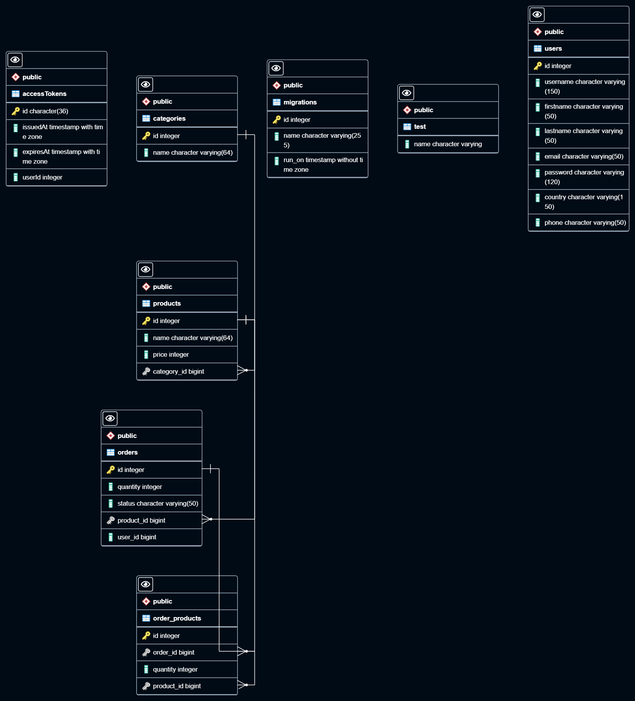
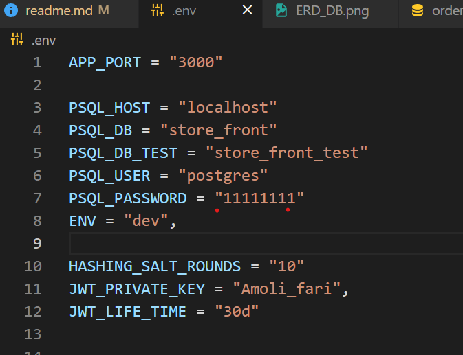

# Udacity: Build a Storefront Backend

## Contents:

1-Description.

2-Project build depended on.

3-Database diagram

4-Project Structure.

5-How To setup project database.

## Description

This is a backend API build in Nodejs for an online store. It exposes a RESTful API that will be used by the frontend developer on the frontend.

The database schema and and API route information can be found in the [REQUIREMENT.md](REQUIREMENTS.md)

## Database diagram



### Installing

- You cane download my project.

```
git clone https://github.com/aml-fakhry/store_front_APP.git
```

- project requires having node installed https://nodejs.org/en/download/

## Project build depended on

- The language used and application logic

1. [TypeScript](https://www.typescriptlang.org/docs/)
2. [Node.JS](https://nodejs.org/dist/latest-v16.x/docs/api/)
3. [Express](https://expressjs.com/)

- For managing environment variables

1. [dotenv](https://www.npmjs.com/package/dotenv)

- For the database and migration

1. [pg](https://node-postgres.com/)
2. [db-migrate](https://db-migrate.readthedocs.io/en/latest/)
3. [db-migrate-pg](https://www.npmjs.com/package/db-migrate-pg)

- For authentication and security

1. [jsonwebtoken](https://www.npmjs.com/package/jsonwebtoken)
2. [bcrypt](https://www.npmjs.com/package/bcrypt)

- For Fixing and Formatting Code

1. [ESLint](https://eslint.org/docs/user-guide/getting-started)
2. [Prettier](https://prettier.io/docs/en/index.html)

- For Unit testing

1. [Jasmine](https://jasmine.github.io/)
2. [supertest](https://www.npmjs.com/package/supertest)

### Executing program (scripts)

- Install all dependencies

```
yarn
```

- Run the program in development environment.

```
yarn dev
```

- Run compiled code (build).

```
yarn start:build
```

- Run test program.

```
yarn test
```

- Lint script.

```
yarn lint
```

- Format script.

```
yarn format
```

- test database

```
yarn "test:db"
```

- ports the backend and database are running on

```
http://localhost:3000
```

## ENV variable

- port for run project

```
  APP_PORT = "3000"
```

- keys for database configuration

```
PSQL_HOST = "localhost"
PSQL_DB = "store_front"
PSQL_DB_TEST = "store_front_test"
PSQL_USER = "postgres"
PSQL_PASSWORD = "11111111"
ENV = "dev",
```

- keys for encrypt data and jwt.

```
HASHING_SALT_ROUNDS = "10"
JWT_PRIVATE_KEY = "Amoli_fari",
JWT_LIFE_TIME = "30d"
```



## Functionality

```
- we have 4 main dataAccess contain functionalities for create and search in different cases requirement.
1. userDataAccess
2. productDataAccess
3. orderDataAccess
4. categoryDataAccess

```

### How To setup project database.

1- create database script.

```javascript

CREATE DATABASE store_front
   WITH OWNER = postgres
   ENCODING = 'UTF8'
   LC_COLLATE = 'Arabic_Saudi Arabia.1256'
   LC_CTYPE = 'Arabic_Saudi Arabia.1256'
   TABLESPACE = pg_default CONNECTION
   LIMIT = -1;
```

2- create user script.

```javascript
-- Database: store_front

CREATE TABLE users (
  id SERIAL PRIMARY KEY,
  username VARCHAR(150) NOT NULL,
  firstname VARCHAR(50) NOT NULL,
  lastname VARCHAR(50) NOT NULL,
  email VARCHAR(50) NOT NULL,
  password VARCHAR(120) NOT NULL,
  country VARCHAR(150),
  phone VARCHAR(50)
);
```

3- create accessTokens script.

```javascript

CREATE TABLE public."accessTokens" (
  id character(36) COLLATE pg_catalog."default" NOT NULL,
  "issuedAt" timestamp with time zone NOT NULL,
  "expiresAt" timestamp with time zone NOT NULL,
  "userId" integer NOT NULL,
  CONSTRAINT "accessTokens_pkey" PRIMARY KEY (id),
  CONSTRAINT "accessTokens_userId_fkey" FOREIGN KEY ("userId") REFERENCES public.users (id) MATCH SIMPLE ON UPDATE NO ACTION ON DELETE NO ACTION
) TABLESPACE pg_default;
```

4- create categories script.

```javascript

CREATE TABLE public."categories" (
  id SERIAL PRIMARY KEY,
  name VARCHAR(64) NOT NULL
);
```

5- create products script.

```javascript

CREATE TABLE public."products" (
  id SERIAL PRIMARY KEY,
  name VARCHAR(64) NOT NULL,
  price integer NOT NULL,
  category_id bigint REFERENCES categories(id)
);

```

5- create orders script.

```javascript

CREATE TABLE public."orders" (
  id SERIAL PRIMARY KEY,
  quantity integer NOT NULL,
  status VARCHAR(15),
  product_id bigint REFERENCES products(id),
  user_id bigint REFERENCES users(id)
);
```

6- create order_products script.

```javascript

CREATE TABLE public."order_products" (
  id SERIAL PRIMARY KEY,
  quantity integer NOT NULL,
  order_id bigint REFERENCES orders(id) NOT NULL,
  product_id bigint REFERENCES products(id) NOT NULL
);
```

## Endpoints

> Here My work space in postman contain store front collection
> [](https://lunar-zodiac-696136.postman.co/workspace/My-Workspace~f39f8c95-ce31-4043-8a02-9e8b06cea226/collection/10248046-39b56467-ae7b-4485-ad8a-bcc6a5bb3e17?ctx=documentation)

## License

This project is licensed under the Aml Fakhri License - see the LICENSE.md file for details

## Project structure.

```

.
📦src
┣ 📂data
┃ ┣ 📂category
┃ ┃ ┣ 📂data
┃ ┃ ┃ ┣ 📜category.data.ts
┃ ┃ ┃ ┗ 📜index.ts
┃ ┃ ┣ 📂model
┃ ┃ ┃ ┣ 📜category.dto.ts
┃ ┃ ┃ ┗ 📜index.ts
┃ ┃ ┗ 📜index.ts
┃ ┣ 📂order
┃ ┃ ┣ 📂data
┃ ┃ ┃ ┣ 📜index.ts
┃ ┃ ┃ ┗ 📜order.data.ts
┃ ┃ ┣ 📂model
┃ ┃ ┃ ┣ 📜index.ts
┃ ┃ ┃ ┗ 📜order.model.ts
┃ ┃ ┗ 📜index.ts
┃ ┣ 📂product
┃ ┃ ┣ 📂data
┃ ┃ ┃ ┣ 📜index.ts
┃ ┃ ┃ ┗ 📜product.data.ts
┃ ┃ ┣ 📂model
┃ ┃ ┃ ┣ 📜index.ts
┃ ┃ ┃ ┗ 📜product.dto.ts
┃ ┃ ┗ 📜index.ts
┃ ┣ 📂user
┃ ┃ ┣ 📂data
┃ ┃ ┃ ┣ 📜index.ts
┃ ┃ ┃ ┗ 📜user.data.ts
┃ ┃ ┣ 📂model
┃ ┃ ┃ ┣ 📜access-token.dto.ts
┃ ┃ ┃ ┣ 📜index.ts
┃ ┃ ┃ ┗ 📜user.dto.ts
┃ ┃ ┗ 📜index.ts
┃ ┗ 📜index.ts
┣ 📂database
┃ ┣ 📂tables
┃ ┃ ┣ 📜access_token.schema.sql
┃ ┃ ┣ 📜category.table.sql
┃ ┃ ┣ 📜order.schema.sql
┃ ┃ ┣ 📜product.schema.sql
┃ ┃ ┗ 📜user.schema.sql
┃ ┗ 📜database.helper.ts
┣ 📂routes
┃ ┣ 📂api
┃ ┃ ┣ 📜category.routes.ts
┃ ┃ ┣ 📜index.ts
┃ ┃ ┣ 📜order.routes.ts
┃ ┃ ┣ 📜product.routes.ts
┃ ┃ ┗ 📜user.routes.ts
┃ ┗ 📜index.ts
┣ 📂server
┃ ┣ 📜index.ts
┃ ┗ 📜server.ts
┣ 📂shared
┃ ┣ 📂middleware
┃ ┃ ┣ 📜auth.middleware.ts
┃ ┃ ┣ 📜error-handler.middleware.ts
┃ ┃ ┗ 📜index.ts
┃ ┣ 📂model
┃ ┃ ┣ 📜app-error-code.model.ts
┃ ┃ ┣ 📜app-error-model.ts
┃ ┃ ┣ 📜app-http-response-error.model.ts
┃ ┃ ┣ 📜app-http-response.model.ts
┃ ┃ ┣ 📜data-result.model.ts
┃ ┃ ┗ 📜index.ts
┃ ┣ 📂utils
┃ ┃ ┣ 📜hash.util.ts
┃ ┃ ┣ 📜http-response.util.ts
┃ ┃ ┣ 📜index.ts
┃ ┃ ┣ 📜jsonwebtoken.util.ts
┃ ┃ ┗ 📜logger.util.ts
┃ ┗ 📜index.ts
┣ 📂tests
┃ ┣ 📂helpers
┃ ┃ ┗ 📜reporter.ts
┃ ┣ 📜app.spec.ts
┃ ┗ 📜test.spec.ts
┣ 📂typings
┃ ┗ 📂global
┃ ┃ ┗ 📜index.d.ts
┗ 📜app.ts

```

## Authors

Contributors names and contact info

ex. Aml fakhri
ex. [@aml_fakhri](amlfakhry13@gmail.com)
